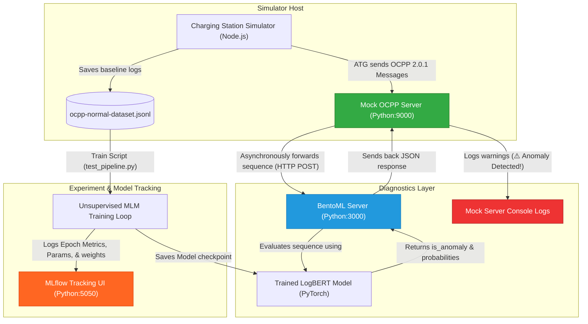

# E-Mobility OCPP Diagnostics: Self-Supervised Anomaly Detection via LogBERT

[](https://www.python.org/)
[](https://nodejs.org/)
[](https://www.docker.com/)
[](https://pytorch.org/)
[](https://mlflow.org/)
[](https://www.bentoml.com/)
[](#acknowledgments--funding)

An end-to-end, real-time anomaly detection and diagnostic pipeline for electric vehicle (EV) charging stations. Using **LogBERT** (a Transformer Encoder trained via self-supervised Masked Language Modeling), this project intercepts OCPP 2.0.1 log sequences in real-time, registers metrics on **MLflow**, and serves diagnostic predictions via **BentoML** containers.

---

## Table of Contents
1. [Short Description](#short-description)
2. [Background & Architecture](#background--architecture)
3. [Dependencies & Prerequisites](#dependencies--prerequisites)
4. [Installation & Deployment](#installation--deployment)
5. [Uninstallation & Cleanup](#uninstallation--cleanup)
6. [Configuration](#configuration)
7. [Usage & Examples](#usage--examples)
8. [API & Metrics](#api--metrics)
9. [Maintainers & Contributors](#maintainers--contributors)
10. [Contributing](#contributing)
11. [License](#license)

---

## Short Description
This repository integrates a full-scale EV Charging Station Simulator with a real-time deep learning diagnostic stack. It automatically ingests raw OCPP message streams, builds sliding log templates, and uses a pre-trained LogBERT transformer to flag network disconnects, authorization bypasses, connector errors, and protocol violations. It is designed to be easily deployed on cloud virtual machines (VMs) using Docker Compose.

---

## Background & Architecture

The system operates as a five-tier distributed architecture, fully containerized:

1. **Charging Station Simulator**: Generates real-world OCPP 2.0.1 transaction streams using an Automatic Transaction Generator (ATG).
2. **OCPP Mock Server**: Intercepts WebSocket messages from charging stations, holds a sliding window of the last 10 frames per station, and forwards them for diagnostics.
3. **BentoML Server**: Runs inference using the PyTorch-based LogBERT model to calculate sequence probabilities.
4. **MLflow Tracking UI**: Logs model hyperparameters, training/validation loss, and MLM accuracies per epoch.
5. **Vite Web Dashboard**: Provides a visual interface to manage the charging stations and monitor their WebSocket connectivity states.

### Data Flow Diagram



---

## Dependencies & Prerequisites

To run the project in production (recommended), the only prerequisites are:
- **Docker** >= 24.0.0
- **Docker Compose** >= 2.20.0

For local development without containers, you will need:
- **Python** = 3.12
- **Node.js** >= 22.0.0
- **pnpm** >= 10.9.0
- **Poetry** (optional, for Python dependency management)

---

## Installation & Deployment

Deploying the entire 5-container stack is done with a single command.

1. Clone the repository:
   ```bash
   git clone https://github.com/your-username/e-mobility-ocpp-diagnostics.git
   cd e-mobility-ocpp-diagnostics
   ```

2. Build and start the containers in the background:
   ```bash
   docker compose up --build -d
   ```

3. Confirm that all containers started successfully:
   ```bash
   docker compose ps
   ```

Once deployed, the following ports are mapped to your host machine:
- **MLflow Tracking UI**: [http://localhost:5050](http://localhost:5050)
- **BentoML Swagger UI**: [http://localhost:3000](http://localhost:3000)
- **Vite Web Dashboard**: [http://localhost:5173](http://localhost:5173)
- **Mock OCPP Server**: `ws://localhost:9000`

---

## Uninstallation & Cleanup

To stop and remove all containers, networks, and anonymous volumes safely, run:
```bash
docker compose down -v
```

This ensures cluster hygiene and frees up all bound ports (`3000`, `5050`, `9000`, `8080`, `5173`) on the host.

---

## Configuration

Custom options are configured in the following files:

### 1. Docker Compose Configurations
In [docker/config.json](file:///c:/e-mobility-charging-stations-simulator-main/docker/config.json), you can edit:
- `supervisionUrls`: Configured to `["ws://ocpp-mock-server:9000"]` inside the network.
- `stationTemplateUrls`: Specifies templates and number of active stations to spin up.

### 2. OCPP Mock Server Parameters
Arguments can be modified in [docker-compose.yml](file:///c:/e-mobility-charging-stations-simulator-main/docker-compose.yml) under the `ocpp-mock-server` service command:
- `--auth-mode`: `blacklist` or `whitelist`.
- `--blacklist`: Space-separated blocked RFID tokens.
- `BENTOML_URL`: Endpoint target for evaluations.

---

## Usage & Examples

### 1. Access the Dashboards
* Open [http://localhost:5173](http://localhost:5173) in your browser. Refresh the page to verify that the simulator dashboard displays `CONNECTED` (green) and shows all 12 KeBa charging stations.
* Open the Mock Server log stream to watch connections establish:
  ```bash
  docker compose logs -f ocpp-mock-server
  ```

### 2. Trigger Anomaly Injection Scenarios
Open a new terminal in the project root and run any of the automated fault-injection scripts:

* **Authorization Anomaly (Blocked RFID Card)**:
  ```bash
  node LOGS/bad_authorizations.js
  ```
* **Network Anomaly (Abrupt WebSocket Close)**:
  ```bash
  node LOGS/disconnect_stations.js
  ```
* **Hardware Anomaly (Connector Ground Fault)**:
  ```bash
  node LOGS/connector_errors.js
  ```
* **Protocol Anomaly (Ending non-existent transaction ID)**:
  ```bash
  node LOGS/invalid_stops.js
  ```

When you execute any of these scripts, watch your `ocpp-mock-server` terminal. You will see warning alerts printed in real-time as the LogBERT model flags them:
```text
WARNING:root: ⚠️ Anomaly Detected! Sequence: ['BootNotification', 'Response', 'Authorize', 'Response', 'StatusNotification', 'Response', 'Error'] | Avg Prob: 0.3216
```

---

## API & Metrics

### BentoML Evaluation Endpoint
- **Endpoint**: `POST http://localhost:3000/evaluate`
- **Payload**:
  ```json
  {
    "sequence": [
      "[2,\"msg-1\",\"BootNotification\",{}]",
      "[3,\"msg-1\",{\"status\":\"Accepted\"}]",
      "[4,\"msg-2\",\"ProtocolError\",\"Malformed raw frame\",{}]"
    ]
  }
  ```
- **Response**:
  ```json
  {
    "timestamp": "2026-07-14T13:04:53Z",
    "sequence": ["BootNotification", "Response", "Error"],
    "token_ids": [1, 2, 8, 0, 0, 0, 0, 0, 0, 0],
    "probabilities": [0.03, 0.975, 0.0092],
    "average_probability": 0.3216,
    "is_anomaly": true
  }
  ```

### MLflow Training Metrics
Training is tracked using:
- **Metrics**: `train_loss`, `train_accuracy`, `val_loss`, and `val_accuracy` logged per epoch.
- **Visual Curves**: Graphs are rendered in real-time in the MLflow UI (`http://localhost:5050`) to observe learning rate schedules and early stopping checkpoints.

---

## Maintainers & Contributors
- **Lead Developer**: [Ioannis Ktenidis](https://github.com/IoannisKtenidis)

---

## Contributing
We welcome contributions! Please follow these guidelines:
1. Fork the repository.
2. Create a feature branch (`git checkout -b feature/AmazingFeature`).
3. Commit your changes (`git commit -m 'Add some AmazingFeature'`).
4. Push to the branch (`git push origin feature/AmazingFeature`).
5. Open a Pull Request.

---


## License
Distributed under the **MIT License**. See `LICENSE` for more information.
